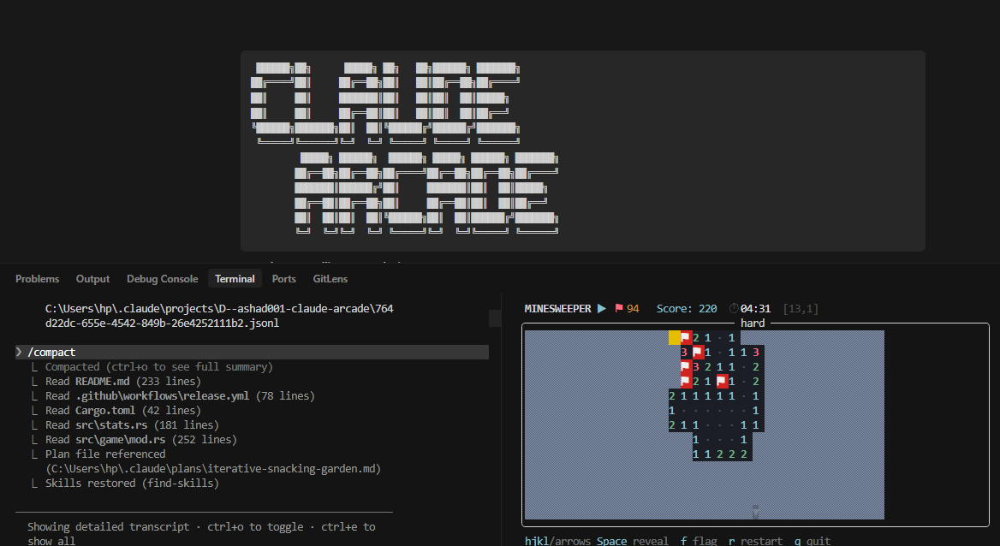

<div align="center">

```
 ██████╗██╗      █████╗ ██╗   ██╗██████╗ ███████╗
██╔════╝██║     ██╔══██╗██║   ██║██╔══██╗██╔════╝
██║     ██║     ███████║██║   ██║██║  ██║█████╗
██║     ██║     ██╔══██║██║   ██║██║  ██║██╔══╝
╚██████╗███████╗██║  ██║╚██████╔╝██████╔╝███████╗
 ╚═════╝╚══════╝╚═╝  ╚═╝ ╚═════╝ ╚═════╝ ╚══════╝
         █████╗ ██████╗  ██████╗ █████╗ ██████╗ ███████╗
        ██╔══██╗██╔══██╗██╔════╝██╔══██╗██╔══██╗██╔════╝
        ███████║██████╔╝██║     ███████║██║  ██║█████╗
        ██╔══██║██╔══██╗██║     ██╔══██║██║  ██║██╔══╝
        ██║  ██║██║  ██║╚██████╗██║  ██║██████╔╝███████╗
        ╚═╝  ╚═╝╚═╝  ╚═╝ ╚═════╝╚═╝  ╚═╝╚═════╝ ╚══════╝
```

**Stop doom-scrolling. Start playing.**

Terminal Minesweeper that runs beside Claude Code — so you stay focused,\
and never miss a permission prompt again.

[](https://github.com/Ashad001/claude-arcade/releases)
[](LICENSE)
[](https://www.rust-lang.org/)
[](#install)



</div>

---

```
┌─────────────────────────────┬──────────────────────────────────────┐
│  claude                     │  claude-arcade                       │
│                             │                                      │
│  > refactor auth module     │   MINESWEEPER ▶  ⚑ 37   Score: 840  │
│  ⏺ working: Edit            │  ╭──────── medium ──────────────╮    │
│                             │  │ ▒▒ ▒▒ ▒▒  1  ·  ▒▒ ▒▒ ▒▒ ▒▒ │    │
│                             │  │ ▒▒  1  ·  ·   1  2  ▒▒ ▒▒ ▒▒ │    │
│                             │  │ ▒▒ ▒▒ ██  2  ▒▒ ▒▒  3  ▒▒ ▒▒ │    │
│                             │  │ ▒▒ ▒▒ ▒▒ ▒▒  1  ·  ▒▒ ▒▒ ▒▒ │    │
│                             │  ╰───────────────────────────────╯   │
│                             │   ⏺ Claude is working: Edit          │
└─────────────────────────────┴──────────────────────────────────────┘
```

> **The problem:** Claude is thinking. You open Twitter. You miss the permission prompt. You lose 20 minutes.
>
> **The fix:** A game that runs in your terminal keeps your eyes in the right place.

---

## How it works

Claude Code fires shell hooks on every tool call. Those hooks write a tiny JSON file. The game reads it every 100ms and reacts:

```
Claude working    →  blue border      ⏺ Claude is working: Bash
Permission needed →  RED FLASHING 🔔  ⚠ CLAUDE NEEDS PERMISSION — SWITCH PANES
Claude idle       →  yellow border    ⏸ Claude is waiting for your input
Claude done       →  green border ✓   Claude finished  (auto-clears after 3s)
```

**When permission is needed:** the game freezes, the border flashes red, a terminal bell rings, and your score multiplier pauses. Missing a prompt has an actual cost.

---

## Install

### Linux / macOS

> Requires [tmux](https://github.com/tmux/tmux/wiki/Installing) and [Claude Code](https://claude.ai/code)

```bash
# 1. Download the binary for your platform
# Linux x86_64
curl -LsSf https://github.com/Ashad001/claude-arcade/releases/latest/download/claude-arcade-v0.1.0-x86_64-unknown-linux-gnu.tar.gz | tar -xz -C ~/.local/bin/

# Linux ARM64
curl -LsSf https://github.com/Ashad001/claude-arcade/releases/latest/download/claude-arcade-v0.1.0-aarch64-unknown-linux-gnu.tar.gz | tar -xz -C ~/.local/bin/

# macOS (Apple Silicon)
curl -LsSf https://github.com/Ashad001/claude-arcade/releases/latest/download/claude-arcade-v0.1.0-aarch64-apple-darwin.tar.gz | tar -xz -C ~/.local/bin/

# 2. Wire up Claude Code hooks (one-time)
claude-arcade install

# 3. Start a tmux session, then launch Claude inside it
tmux new-session
claude
```

The game opens automatically in a split pane every time Claude starts working.

### Windows (via WSL2)

Everything runs inside WSL2 — the POSIX hooks, tmux, and the game itself.

```powershell
# 1. Install WSL2 (PowerShell, run as admin)
wsl --install
```

```bash
# 2. Inside WSL — install dependencies
sudo apt update && sudo apt install tmux jq

# 3. Install Claude Code inside WSL
npm install -g @anthropic-ai/claude-code

# 4. Install claude-arcade
curl -LsSf https://github.com/Ashad001/claude-arcade/releases/latest/download/claude-arcade-v0.1.0-x86_64-unknown-linux-gnu.tar.gz | tar -xz -C ~/.local/bin/
claude-arcade install

# 5. Always run claude from inside tmux, inside WSL
tmux new-session
claude
```

> **Important:** Run `claude` from the WSL terminal — not PowerShell or Windows Terminal. The hooks live in `~/.claude/` inside WSL, separate from any Windows-native Claude install.

### Cargo (Rust developers)

```bash
cargo install claude-arcade
```

---

## Visual states

| State | Border | Footer | Score |
|---|---|---|---|
| Working | 🔵 Blue | `⏺ Claude is working: <tool>` | Counting |
| Permission needed | 🔴 **Flashing red** + 🔔 bell | `⚠ CLAUDE NEEDS PERMISSION` | **Frozen** |
| Idle | 🟡 Yellow | `⏸ Claude is waiting` | Counting |
| Done | 🟢 Green (3s) | `✓ Claude finished` | Counting |
| No session | — Plain | Key hints | Counting |

---

## Controls

| Key | Action |
|---|---|
| `hjkl` / arrow keys | Move cursor |
| `Space` / `Enter` | Reveal cell |
| `f` | Toggle flag |
| `r` | Restart |
| `Tab` | Leaderboard overlay |
| `q` / `Esc` | Quit |

---

## Difficulty

```bash
claude-arcade play                        # 16×16, 40 mines (default)
claude-arcade play --difficulty easy      #  9×9,  10 mines
claude-arcade play --difficulty hard      # 30×16, 99 mines
```

Harder difficulty = higher score multiplier.

---

## Leaderboard & stats

Games are saved to `~/.claude-arcade/stats.json` after each round.

```bash
# Print top 10 in the terminal
claude-arcade stats
```

Press `Tab` in-game to toggle the leaderboard overlay.

---

## Simulate hook events (for testing)

```bash
# Working
echo '{"status":"working","tool":"Bash","updated_at":"2026-05-22T14:00:00Z"}' \
  > ~/.claude-arcade/state.json

# Permission needed — watch it flash red and ring
echo '{"status":"permission_needed","updated_at":"2026-05-22T14:00:01Z"}' \
  > ~/.claude-arcade/state.json

# Done
echo '{"status":"done","updated_at":"2026-05-22T14:00:02Z"}' \
  > ~/.claude-arcade/state.json
```

---

## Building from source

```bash
git clone https://github.com/Ashad001/claude-arcade
cd claude-arcade
cargo build --release
cargo test
cargo run -- play
```

---

## Uninstall

```bash
claude-arcade uninstall
```

Removes hooks and `~/.claude/hooks/claude-arcade/`. Your `~/.claude-arcade/stats.json` score history is kept.

---

## Privacy

No telemetry. No network calls after install. The game reads a local file that the hooks write — nothing leaves your machine.

---

<div align="center">

Built with Rust + [ratatui](https://ratatui.rs) · MIT License

*The best code review is one you're actually present for.*

</div>
